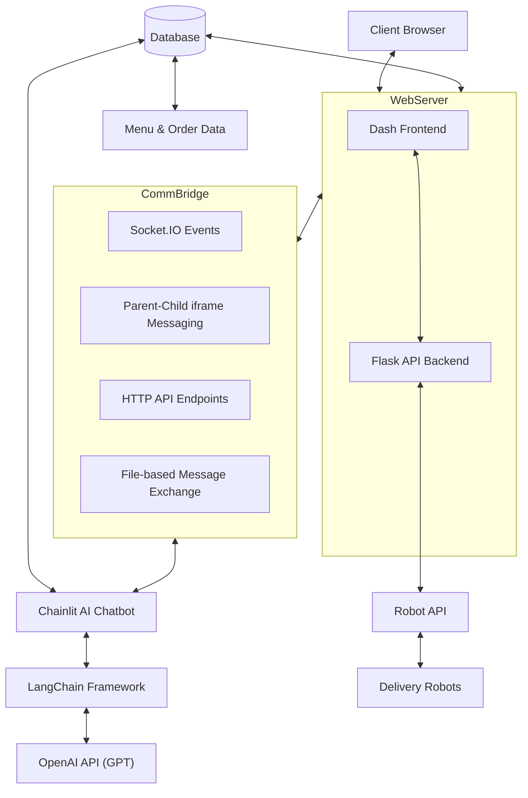
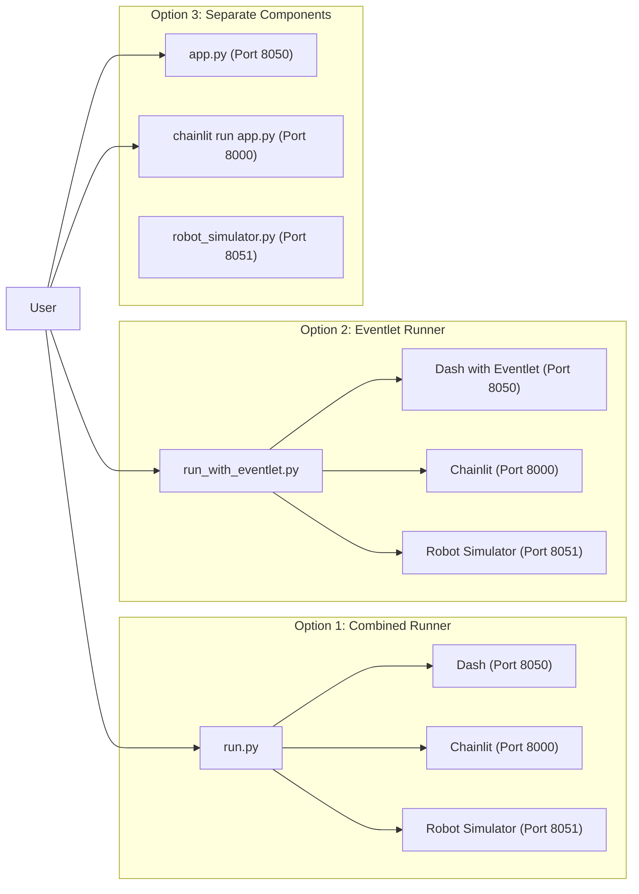
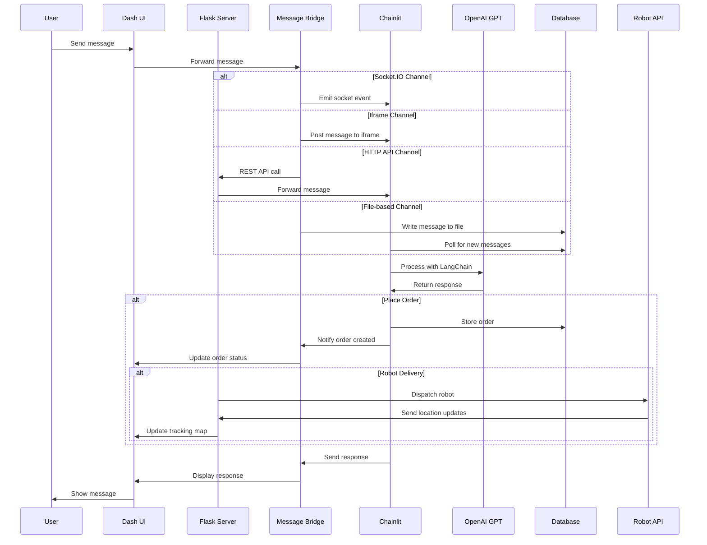

# Neo Cafe Dashboard System Architecture

## Overview
The Neo Cafe Dashboard is an integrated application featuring a coffee-themed interface with order management, menu display, delivery tracking, and an AI-powered chatbot assistant. The system uses a multi-component architecture with robust communication channels between components.

## Architecture Diagram



## Core Components

### 1. Web Application (Dash + Flask)
- **Frontend**: Built with Dash (a Python framework for building analytical web applications)
  - Interactive UI components
  - Real-time data visualization with Plotly
  - Bootstrap for responsive styling
  - Client-side JavaScript for enhanced interactivity

- **Backend**: Flask server
  - RESTful API endpoints
  - Session management
  - Authentication handling
  - Database interactions

### 2. AI Chatbot (Chainlit)
- Chainlit framework for chat interface
- LangChain integration for:
  - Knowledge base retrieval
  - Order processing
  - Menu search
  - Customer assistance

### 3. Database System
- SQLite database for:
  - Order management
  - User information
  - Menu items
  - Chat history preservation

### 4. Communication Bridge
Implements multiple redundant channels for reliable communication:
- **Socket.IO**: Real-time bidirectional event-based communication
- **Parent-Child iframe Messaging**: Direct browser messaging
- **HTTP API endpoints**: Standard REST communication
- **File-based Message Exchange**: Fallback mechanism for reliability

### 5. Order Management System
- Order creation, tracking, and updating
- Inventory management
- Delivery tracking

### 6. Robot Delivery System
- Simple API interface to robot fleet
- Dispatch and tracking capabilities
- Real-time delivery status updates

## Data Flow

1. **User Interface Interactions**:
   - Users interact with the Dash frontend
   - UI events trigger callbacks
   - Callbacks communicate with backend services

2. **Order Processing**:
   - Orders can be placed via dashboard or chatbot
   - Multiple validation and standardization steps
   - Persistent storage in database
   - Real-time status updates

3. **Chat Communication**:
   - Messages flow between dashboard and chatbot
   - Multiple fallback mechanisms ensure delivery
   - Session persistence across components

4. **AI Assistant Flow**:
   - User queries processed by LangChain agent
   - Vector store used for knowledge retrieval
   - Specialized tools for different functions (menu search, order placement, etc.)
   - Responses formatted for appropriate context

5. **Robot Delivery Flow**:
   ```mermaid
   sequenceDiagram
       participant Dashboard
       participant RobotAPI
       participant Robot
       
       Dashboard->>RobotAPI: Dispatch order
       RobotAPI->>Robot: Send delivery instructions
       Robot->>RobotAPI: Send location updates
       RobotAPI->>Dashboard: Update delivery status
       Robot->>RobotAPI: Order delivered
       RobotAPI->>Dashboard: Mark order complete
   ```

## Technology Stack

- **Frontend**: 
  - Dash (Python-based React)
  - Bootstrap CSS
  - Socket.IO client
  - Custom JavaScript

- **Backend**:
  - Flask
  - Socket.IO
  - Eventlet (for optimized Socket.IO)

- **AI Components**:
  - Chainlit
  - LangChain
  - OpenAI API (GPT models)
  - FAISS vector store

- **Robot Delivery**:
  - REST API endpoints (GET/POST/PUT)
  - WebSocket for real-time location tracking
  - Plotly for map visualization

- **Database**:
  - SQLite

- **Infrastructure**:
  - Synchronous and asynchronous processing
  - Multi-process application startup
  - Graceful error handling and recovery

## Deployment Architecture



The application can be deployed in three ways:
1. **Combined Runner**: Starts both Dash and Chainlit simultaneously
2. **Eventlet Runner**: Optimized for Socket.IO performance
3. **Separate Components**: Individual startup for development purposes

## Communication Sequence



## Key Design Patterns

1. **Bridge Pattern**: Used in message_bridge.py to decouple abstraction from implementation
2. **Observer Pattern**: Used in Socket.IO event handling
3. **Fallback Strategy Pattern**: Multiple communication methods with automatic fallback
4. **Factory Pattern**: For creating various UI components
5. **Proxy Pattern**: In the chatbot's knowledge base search

## Security Considerations

- Session-based authentication
- Token verification between components
- Cross-origin resource sharing configuration
- Error handling that doesn't expose sensitive information
- Secure robot command validation
- Emergency stop capability