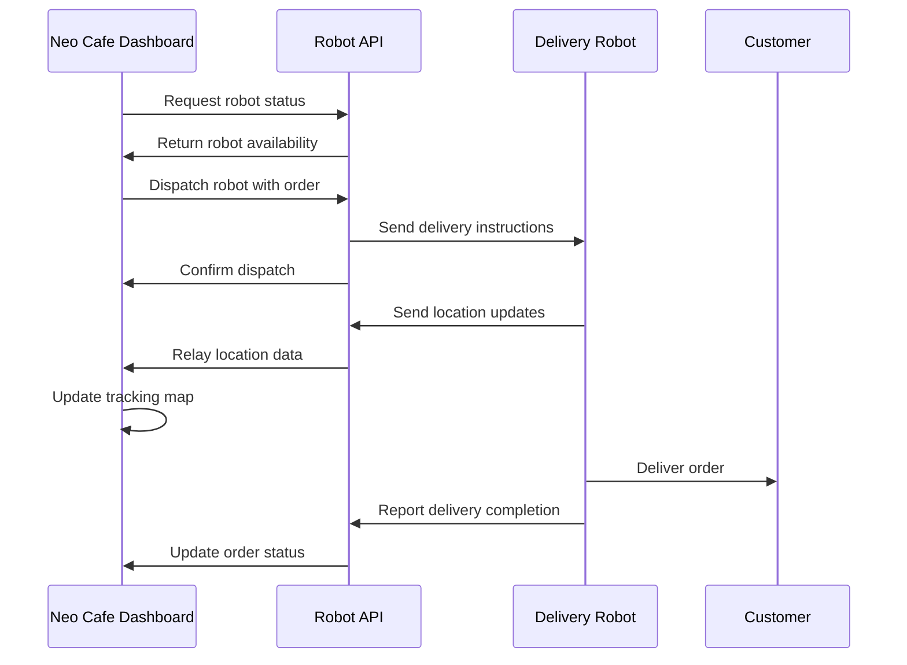

# Neo Cafe Robot Delivery System

This document outlines how the Neo Cafe Dashboard system communicates with delivery robots to automate order delivery to customers.

## Architecture Overview



## Robot Communication Interface

The system communicates with robots through a dedicated Robot Simulator API. The API endpoints are:

- **GET /api/status**: Retrieves general status of all robots
- **GET /api/delivery/{order_id}**: Gets status of a specific delivery
- **POST /api/place-order**: Dispatches a robot with an order
- **PUT /api/orders/{order_id}/status**: Updates the status of an order/delivery

### Configuration

The Robot Simulator URL is configured in the environment variables:

```
ROBOT_SIMULATOR_URL=http://localhost:8051
```

This can be overridden in the .env file or set as an environment variable.

## Robot Control Commands

### 1. Dispatching a Robot

To dispatch a robot with an order, use the following API call:

```python
from app.utils.api_utils import place_order

# Create order payload
order_data = {
    "id": "ORD-123456",
    "items": [
        {"item_id": 1, "quantity": 1, "special_instructions": "Extra hot"},
        {"item_id": 7, "quantity": 2, "special_instructions": ""}
    ],
    "delivery_location": {
        "type": "table",
        "id": "Table 5",
        "coordinates": {
            "lat": 37.7749,
            "lng": -122.4194
        }
    },
    "customer_id": "CUST-789",
    "priority": "normal"
}

# Dispatch robot
response = place_order(order_data)
```

### 2. Tracking Robot Location

Robot location is tracked through both API polling and real-time WebSocket events:

```python
from app.utils.api_utils import get_robot_status

# Get delivery status
status = get_robot_status(order_id="ORD-123456")

# Sample response
{
    "order_id": "ORD-123456",
    "status": "in_transit",
    "robot_id": "ROBOT-101",
    "battery_level": 85,
    "connection_quality": 92,
    "robot_location": {
        "lat": 37.7749,
        "lng": -122.4194
    },
    "route": [
        {"lat": 37.7749, "lng": -122.4194},  # Origin
        {"lat": 37.7745, "lng": -122.4190},  # Waypoint
        {"lat": 37.7740, "lng": -122.4186}   # Destination
    ],
    "eta": "3 minutes"
}
```

### 3. WebSocket Updates

The system receives real-time updates from robots via WebSocket events:

```javascript
// In JavaScript client
const socket = io();

// Listen for robot updates
socket.on('robot_update', function(data) {
    console.log('Robot update received:', data);
    updateMap(data.robot_location);
    updateDeliveryStatus(data.status);
});
```

The server handles these events in `delivery_callbacks.py`:

```python
@socketio.on('robot_location_update')
def handle_robot_update(data):
    """Handle robot location update events"""
    # Broadcast the robot update to all connected clients
    socketio.emit('robot_update', data)
    print(f"Robot update received for order {data.get('order_id')}")
    return {"status": "success", "message": "Update received"}
```

### 4. Robot Control Commands

The delivery page includes controls for robot operations:

- **Dispatch Robot**: Sends a robot on a delivery mission
- **Recall Robot**: Instructs robot to return to base
- **Emergency Stop**: Immediately halts robot movement for safety

These controls are implemented in the UI with corresponding API calls.

## Robot Status Display

The system displays robot status information including:
- Battery level
- Connection quality
- Current status (Idle, Delivering, Returning, Charging)
- Live location on map
- Delivery route and ETA

## Implementing Your Own Robot Simulator

To implement a real robot control system:

1. Create a Robot Simulator service that implements the API endpoints described above
2. Set the `ROBOT_SIMULATOR_URL` environment variable to point to your service
3. Implement WebSocket event handling for real-time updates

Sample Robot Simulator pseudocode:

```python
from flask import Flask, jsonify, request
from flask_socketio import SocketIO, emit
import threading
import time
import random
import math

app = Flask(__name__)
socketio = SocketIO(app)

# In-memory store of robot status
robots = {
    "ROBOT-101": {
        "status": "idle",
        "battery_level": 100,
        "connection_quality": 100,
        "current_order": None,
        "location": {"lat": 37.7749, "lng": -122.4194}
    }
}

# In-memory store of deliveries
deliveries = {}

@app.route('/api/status')
def get_status():
    """Get overall robot fleet status"""
    return jsonify({"robots": robots})

@app.route('/api/delivery/<order_id>')
def get_delivery(order_id):
    """Get status of specific delivery"""
    if order_id in deliveries:
        return jsonify(deliveries[order_id])
    return jsonify({"status": "not_found", "error": "Delivery not found"}), 404

@app.route('/api/place-order', methods=['POST'])
def place_order():
    """Dispatch robot with order"""
    order_data = request.json
    
    # Find available robot
    available_robot = next((r for r in robots if robots[r]["status"] == "idle"), None)
    
    if not available_robot:
        return jsonify({"status": "error", "error": "No robots available"}), 503
    
    # Update robot status
    robots[available_robot]["status"] = "busy"
    robots[available_robot]["current_order"] = order_data["id"]
    
    # Create delivery
    deliveries[order_data["id"]] = {
        "order_id": order_data["id"],
        "status": "preparing",
        "robot_id": available_robot,
        "battery_level": robots[available_robot]["battery_level"],
        "connection_quality": robots[available_robot]["connection_quality"],
        "robot_location": robots[available_robot]["location"],
        "route": [
            robots[available_robot]["location"],  # Starting point
            order_data["delivery_location"]["coordinates"]  # Destination
        ],
        "eta": "5 minutes"
    }
    
    # Start delivery simulation in background
    threading.Thread(target=simulate_delivery, args=(order_data["id"],)).start()
    
    return jsonify({"status": "success", "delivery": deliveries[order_data["id"]]})

def simulate_delivery(order_id):
    """Simulate a delivery with position updates"""
    if order_id not in deliveries:
        return
    
    delivery = deliveries[order_id]
    robot_id = delivery["robot_id"]
    
    # Update status to in transit
    deliveries[order_id]["status"] = "in_transit"
    socketio.emit('robot_update', deliveries[order_id])
    
    # Get start and end points
    start = delivery["route"][0]
    end = delivery["route"][-1]
    
    # Calculate distance and step size
    distance = math.sqrt((end["lat"] - start["lat"])**2 + (end["lng"] - start["lng"])**2)
    steps = 10  # Number of steps to simulate
    
    # Simulate movement
    for i in range(1, steps + 1):
        # Calculate new position
        new_lat = start["lat"] + (end["lat"] - start["lat"]) * (i / steps)
        new_lng = start["lng"] + (end["lng"] - start["lng"]) * (i / steps)
        
        # Update robot location
        robots[robot_id]["location"] = {"lat": new_lat, "lng": new_lng}
        deliveries[order_id]["robot_location"] = {"lat": new_lat, "lng": new_lng}
        
        # Calculate remaining time
        remaining_steps = steps - i
        eta_minutes = max(1, int(remaining_steps / 2))
        deliveries[order_id]["eta"] = f"{eta_minutes} minutes"
        
        # Emit update
        socketio.emit('robot_location_update', deliveries[order_id])
        
        # Simulate delay
        time.sleep(2)
    
    # Update status to delivered
    deliveries[order_id]["status"] = "delivered"
    robots[robot_id]["status"] = "returning"
    socketio.emit('robot_location_update', deliveries[order_id])
    
    # Simulate return to base
    time.sleep(5)
    robots[robot_id]["location"] = start
    robots[robot_id]["status"] = "idle"
    robots[robot_id]["current_order"] = None
    
    # Emit final update
    socketio.emit('robot_update', {"robot_id": robot_id, "status": "idle"})

if __name__ == '__main__':
    socketio.run(app, host='0.0.0.0', port=8051, debug=True)
```

## Integration with Order System

The robot delivery system is integrated with the order processing system:

1. When an order is placed with delivery type "robot", it's queued for robot delivery
2. The system checks for available robots and dispatches when one is free
3. Order status is updated as the robot progresses through the delivery
4. Delivery completion triggers order status update to "Delivered"

## Security Considerations

- All communication with robots should use secure channels (HTTPS/WSS)
- Implement authentication for robot API endpoints
- Validate all robot commands before execution
- Monitor for suspicious robot behavior or unauthorized commands
- Implement emergency stop functionality for all robots